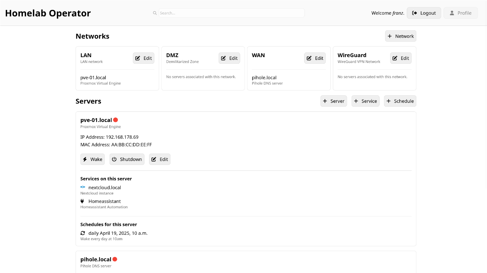

> This project superseeds [flemk/server-dashboard](https://github.com/flemk/server-dashboard)

# Homelab Operator
Homelab Operator displays your homelab infrastructure and provides actions such as wake-on-lan and ssh-shutdown. You can also create an overview of your services running on your machines. You can enable auto-wake where this tool wakes your servers based on usage heuristic.

This tool is still in development.
