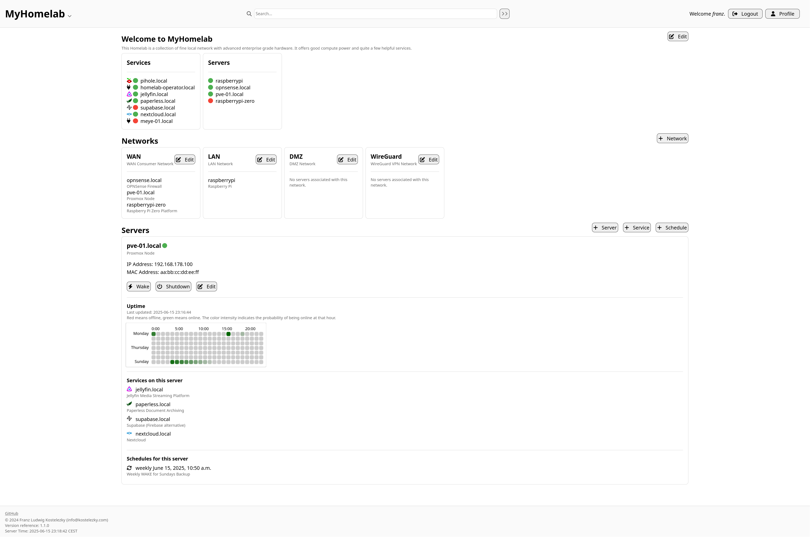

> This project superseeds [flemk/server-dashboard](https://github.com/flemk/server-dashboard)

> This project uses a modified MIT non-commercial license. Details in `LICENSE.md` and at the bottom of this document.

<p align="center">
  
</p>

# Homelab Operator
Homelab Operator displays your homelab infrastructure and provides actions such as wake-on-lan and ssh-shutdown. You can also create an overview of your services running on your machines. You can enable auto-wake where this tool wakes your servers based on usage heuristic (tbd) or create schedules to wake/shutdown your server (which are triggered automatically by the built-in cron service).

This tool is still in development.



## Installation
### Docker Compose
See `docker-compose.yml` or `docker-compose-build-local.yml` and the `.env` file.

The easiest way to run this application is by using docker compose. A sample configuration coul look like:

```yaml
services:
  web:
    image: ghcr.io/flemk/homelab-operator:latest
    environment:
      - POSTGRES_DB=${POSTGRES_DB}
      - POSTGRES_USER=${POSTGRES_USER}
      - POSTGRES_PASSWORD=${POSTGRES_PASSWORD}
      - POSTGRES_HOST=${POSTGRES_HOST}
      - POSTGRES_PORT=${POSTGRES_PORT}
      - ALLOWED_HOST=${ALLOWED_HOST}
      - CSRF_TRUSTED_ORIGIN=${CSRF_TRUSTED_ORIGIN}
      - BROADCAST_ADDRESS=${BROADCAST_ADDRESS}
      - TIME_ZONE=${TIME_ZONE}
      - API_KEY=${API_KEY}
    ports:
      - "${WEB_PORT}:80"
      - "${WEB_SSL_PORT}:443"
    #volumes:
    #  - ./crt:/app/crt  # Use your own certificates
  db:
    image: postgres:14
    environment:
      - POSTGRES_DB=${POSTGRES_DB}
      - POSTGRES_USER=${POSTGRES_USER}
      - POSTGRES_PASSWORD=${POSTGRES_PASSWORD}
    volumes:
      - ./db-data:/var/lib/postgresql/data
```

For WOL to work you need to have a route to the target machine(s). You may need to add the docker container to a macvlan network:
```bash
docker network create \
  -d macvlan \
  --subnet=192.168.1.0/24 \
  --gateway=192.168.1.1 \
  -o parent=eth0 \
  macvlan_net
docker network connect macvlan_net <container>
```
You also may need to adjust the `BROADCAST_ADDRESS=255.255.255.255` environment variable.

**Auto-Wake Functionality**: The cron service is now built into the container and runs automatically every 10 minutes to handle scheduled wake/shutdown operations. No manual cron setup is required. You can monitor the cron service health status in the dashboard.

## License
This project is licensed under a modified MIT **non-commercial** License:

- You may use, copy, modify, and distribute this software for personal and academic purposes.
- Commercial use is prohibited without explicit written permission.

See `LICENSE.md` for full details. Commercial licensing available upon request.
